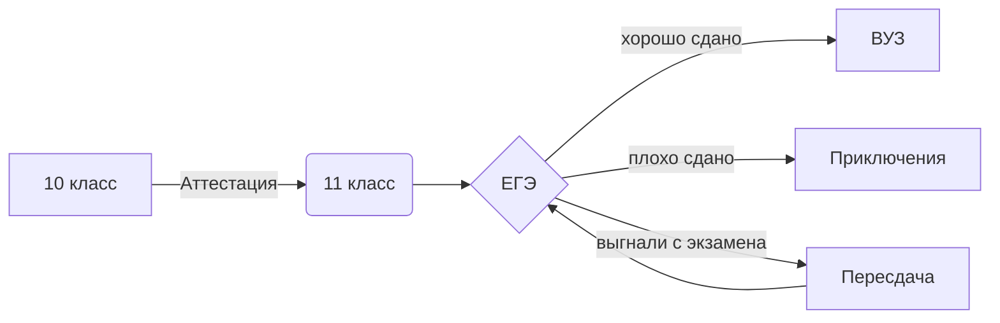
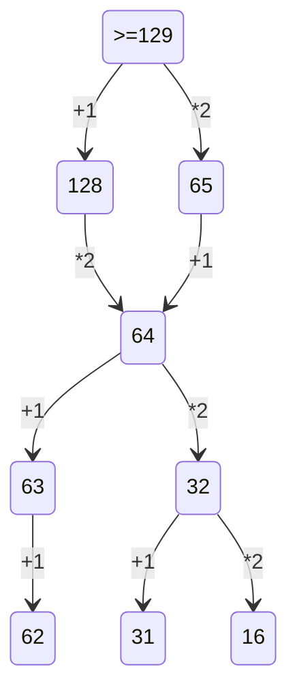

# InfTasks
# Потапова Софья, 142 группа

## Список файлов в репозитории:
- [PHarvester.py](https://github.com/Ethryna/InfTasks/blob/main/PHarvester.py) - сборная солянка из пяти программ: перевод числа из десятичной СС в указанную, из указанной в десятичную, генератор таблиц умножения для СС с основанием в [3,10], кодирование строки азбукой Морзе, алгоритм Хемминга - **Python**
- [Cхема Горнера.py](https://github.com/Ethryna/InfTasks/blob/main/C%D1%85%D0%B5%D0%BC%D0%B0%20%D0%93%D0%BE%D1%80%D0%BD%D0%B5%D1%80%D0%B0.py) - схема Горнера (не доделано) - **Python**
- [Морзянка.xlsx](https://github.com/Ethryna/InfTasks/blob/main/%D0%9C%D0%BE%D1%80%D0%B7%D1%8F%D0%BD%D0%BA%D0%B0.xlsx) - морзянка - **Exсel** 
- [Потапова.xlsx](https://github.com/Ethryna/InfTasks/blob/main/%D0%9F%D0%BE%D1%82%D0%B0%D0%BF%D0%BE%D0%B2%D0%B0.xlsx) - таблицы с СС - **Excel** 
- [TestFunction.py](https://github.com/Ethryna/InfTasks/blob/main/TestFunction.py) - калькулятор для 2х чисел, со спецкурса - **Python**
- [Потапова.pdf](https://github.com/Ethryna/InfTasks/blob/main/%D0%9F%D0%BE%D1%82%D0%B0%D0%BF%D0%BE%D0%B2%D0%B0.pdf) - файл с урока по Dillinger.io (немного об алхимических рецептах Морровинда) - **Markdown**
- [Test.ipynb](https://github.com/Ethryna/InfTasks/blob/main/Test.ipynb) - тестовые строки в Jupyter Notebook c урока - **Jupyter Notebook**
- [Нейросеть.png](https://github.com/Ethryna/InfTasks/blob/main/Нейросеть.png) - нейросеть для сложения и умножения - **скриншот**
- [Логика_таблицы.xlsx](https://github.com/Ethryna/InfTasks/blob/main/%D0%9B%D0%BE%D0%B3%D0%B8%D0%BA%D0%B0_%D1%82%D0%B0%D0%B1%D0%BB%D0%B8%D1%86%D1%8B.xlsx) - таблицы по алгебре логики - **Excel**
- [Logic.py](https://github.com/Ethryna/InfTasks/blob/main/Logic.py) - вычисление комбинаций значений _a, b и c_, при которых значение логического выражения _(A & не B -> C) <-> A_ равно 0 - **Python** 
- [Electricity_bill_change_excel.png](https://github.com/Ethryna/InfTasks/blob/main/Electricity_bill_change_excel.png) - изменённая таблица со счетами за электричество для соответствия реальных затрат ожидаемым в Excel - **скриншот**
- [AutoPaint.png](https://github.com/Ethryna/InfTasks/blob/main/AutoPaint.png) - раскрашивание букв в Paint с помощью Automatic Mouse and Keyboard - **скриншот**
- [Law20.md](https://github.com/Ethryna/InfTasks/blob/main/Law20.md) - закон Моргана №20, формула и картинка - **Latex**
- [Inf_Flask_site.py](https://github.com/Ethryna/InfTasks/blob/main/Inf_Flask_site.py) - сайт с Flask, начало - **Python**
- [Latex-Formulas.md](https://github.com/Ethryna/InfTasks/blob/main/Latex-Formulas.md) - три формулы в Latex - **Latex**
- [кодирование6.py](https://github.com/Ethryna/InfTasks/blob/main/кодирование6.py) - универсальный решатель задач (пока чистый код) - **Python**
- [pictures-in-python.py](https://github.com/Ethryna/InfTasks/blob/main/pictures-in-python.py) - генерация картинок с текстом - **Python**
- [march.jpg](https://github.com/Ethryna/InfTasks/blob/main/march.jpg) - пример сгенерированной картинки (см. п. выше)
- [py-pics-clip-writer.py](https://github.com/Ethryna/InfTasks/blob/main/py-pics-clip-writer.py) - составляет видео (по сути слайд-шоу в формате видео) из картинок в папке и сохраняет туда же - **Python**
- [Quotes.mp4](https://github.com/Ethryna/InfTasks/blob/main/Quotes.mp4) - пример сгенерированного видео (см. выше)
- [TES-lore-quiz.py](https://github.com/Ethryna/InfTasks/blob/main/TES-lore-quiz.py) - викторина по лору The Elder Scrolls - **Python**
- [Three-nums.py](https://github.com/Ethryna/InfTasks/blob/main/Three-nums.py) - сортировка трёх чисел по возрастанию без новых переменных - **Python**

И файлы с решениями заданий ЕГЭ:
- [ЕГЭ.md](https://github.com/Ethryna/InfTasks/blob/main/%D0%95%D0%93%D0%AD.md)
- [ЕГЭ_2_03.10.py](https://github.com/Ethryna/InfTasks/blob/main/%D0%95%D0%93%D0%AD_2_03.10.py)
- [EGE_2_2023Demo(Excel).xlsx](https://github.com/Ethryna/InfTasks/blob/main/EGE_2_2023Demo(Excel).xlsx)
- [EGE_5_2023Demo.py](https://github.com/Ethryna/InfTasks/blob/main/EGE_5_2023Demo.py)
- [EGE_5_2023Demo(Excel).xlsx](https://github.com/Ethryna/InfTasks/blob/main/EGE_5_2023Demo(Excel).xlsx)
- [EGE_8_2023Demo.py](https://github.com/Ethryna/InfTasks/blob/main/EGE_8_2023Demo.py)
- [EGE_9_2023Demo.py](https://github.com/Ethryna/InfTasks/blob/main/EGE_9_2023Demo.py)
- [EGE_6_Turtle_2023Demo.py](https://github.com/Ethryna/InfTasks/blob/main/EGE_6_Turtle_2023Demo.py)
- [EGE_12_list_2023Demo.py](https://github.com/Ethryna/InfTasks/blob/main/EGE_12_list_2023Demo.py)
- [EGE_4_2023Demo.md](https://github.com/Ethryna/InfTasks/blob/main/EGE_4_2023Demo.md)
- [EGE_14_2023Demo.py](https://github.com/Ethryna/InfTasks/blob/main/EGE_14_2023Demo.py)
- [EGE_15_2023Demo.py](https://github.com/Ethryna/InfTasks/blob/main/EGE_15_2023Demo.py)
- [EGE_16_2023Demo.py](https://github.com/Ethryna/InfTasks/blob/main/EGE_16_2023Demo.py)
- [EGE_24_2023Demo.py](https://github.com/Ethryna/InfTasks/blob/main/EGE_24_2023Demo.py)
- [EGE_13_2023Demo.png](https://github.com/Ethryna/InfTasks/blob/main/EGE_13_2023Demo.png)

**Всего решено:** _1, 2, 3, 4, 5, 6, 7, 8, 9, 11, 12, 13, 14, 15, 16, 19, 20, 21, 24._  
**Остались:** _10, 17, 18, 22, 23, 25, 26, 27._

- [Excel-notes.md](https://github.com/Ethryna/InfTasks/blob/main/Excel-notes.md) - заметки про формулы Excel

## CodePen Account: [Ethryna](https://codepen.io/Ethryna)
## Wordpress Website: [Praeterhac](https://praeterhac.wordpress.com)  
  
  
# И прочие заметки:

## ЕГЭ задания 19-21 (схема)

